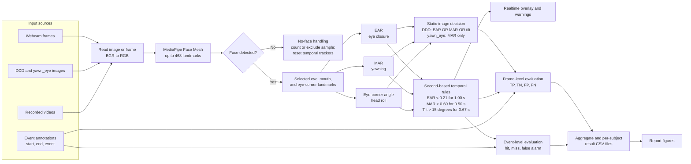

```mermaid
flowchart LR
    subgraph IN[Input sources]
        CAM[Webcam frames]
        IMG[DDD and yawn_eye images]
        VID[Recorded videos]
        ANN[Event annotations\nstart, end, event]
    end

    PRE[Read image or frame\nBGR to RGB]
    FM[MediaPipe Face Mesh\nup to 468 landmarks]
    FACE{Face detected?}
    NF[No-face handling\ncount or exclude sample;\nreset temporal trackers]
    LAND[Selected eye, mouth,\nand eye-corner landmarks]

    EAR[EAR\neye closure]
    MAR[MAR\nyawning]
    TILT[Eye-corner angle\nhead roll]

    STATIC[Static-image decision\nDDD: EAR OR MAR OR tilt\nyawn_eye: MAR only]
    TEMP[Second-based temporal rules\nEAR < 0.21 for 1.00 s\nMAR > 0.60 for 0.50 s\nTilt > 15 degrees for 0.67 s]

    LIVE[Realtime overlay and warnings]
    FEVAL[Frame-level evaluation\nTP, TN, FP, FN]
    EEVAL[Event-level evaluation\nhit, miss, false alarm]
    CSV[Aggregate and per-subject\nresult CSV files]
    FIG[Report figures]

    CAM --> PRE
    IMG --> PRE
    VID --> PRE
    PRE --> FM --> FACE
    FACE -- No --> NF
    FACE -- Yes --> LAND
    LAND --> EAR
    LAND --> MAR
    LAND --> TILT
    EAR --> STATIC
    MAR --> STATIC
    TILT --> STATIC
    EAR --> TEMP
    MAR --> TEMP
    TILT --> TEMP
    TEMP --> LIVE
    STATIC --> FEVAL
    TEMP --> FEVAL
    TEMP --> EEVAL
    ANN --> FEVAL
    ANN --> EEVAL
    FEVAL --> CSV
    EEVAL --> CSV
    CSV --> FIG
```